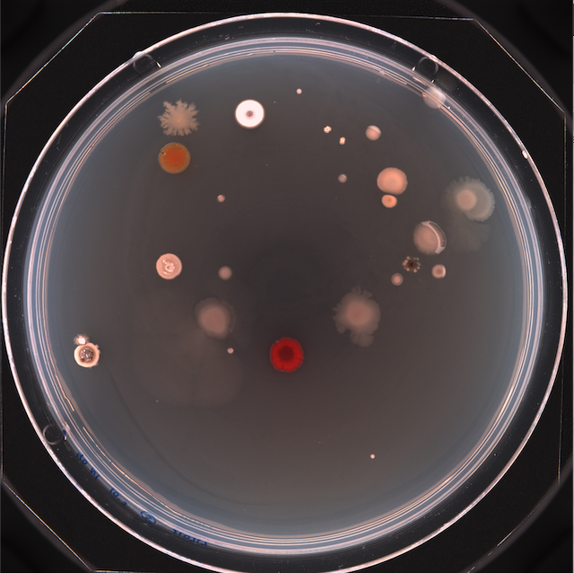
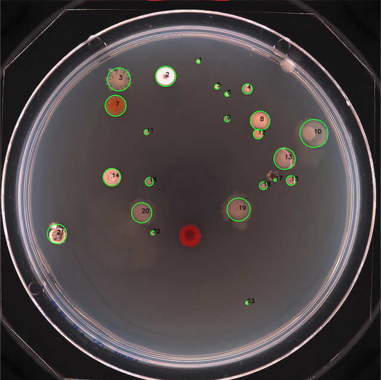
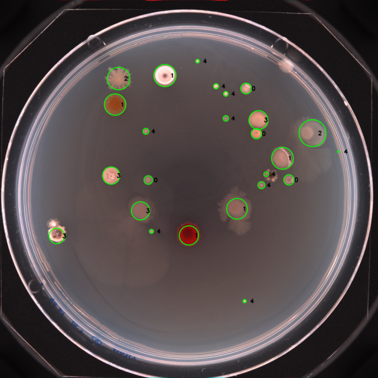

# ColFeatures
ColFeatures is a software that allows bacteria colony identification, data extraction and classification/clustering.

Upload an image like the following:

The identification output looks like this:

The classification/clustering output looks like this:

The .csv file created contains the following information: unique_label,label,centroid-0,centroid-1,area,perimeter,equivalent_diameter,eccentricity,convex_area,mean_intensity-R,mean_intensity-G,mean_intensity-B, cluster_n.
